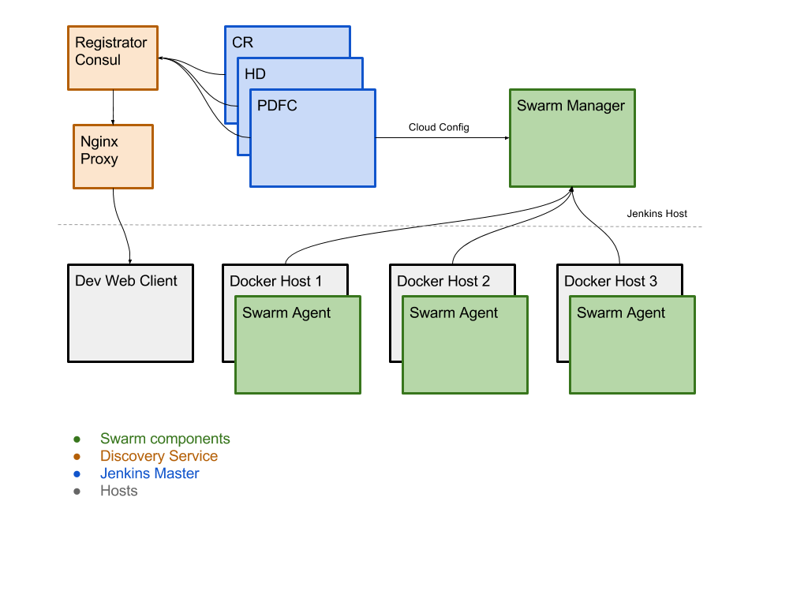

# Docker Boxes

These are container that are being used [@ i-net software](http://www.inetsoftware.de)

## What is in this repository

  - [Jenkins Discovery](./jenkins-discovery)
    * Discovery Service based up on Registrator, Consul and Nginx with Consul-Template
    * Looks for locally running docker container with a specified environment and registeres them in the Nginx via URL extension
  - [Jenkins Autosetup](./jenkins-autosetup)
    * A Jenkins container that takes an SVN or Git Url to automatically set up the configuration and run startup scripts.
  - [Build Slaves](./build-slaves)
    * Ubuntu and Fedora images with build tools, Java and Gradle.

## Why do we need this

Our previous build architecture relied on severeal VMs running Windows and Jenkins (for different product lines), each about 40-80GB in size. Each time we had a software branch we needed to copy the whole VM to be able to reproduce this state. What was in these images?

  - Jenkins host
  - Static libraries (most of them never changed)
  - Build artifacts
  - In addition there are several VMs with build slaves, e.g. Ubuntu, Windows

This setup eats quite a lot of backup space. In addition to the SVN repository we're using for several years now.

### The Goal

It is obvious:

  - Reduce the backup size
  - Reduce the load on bare metal that has to run the VMs
  - Gain better control over branch states for easier backports and re-builds.
  - Have easier ways to add new build slaves into the stack

### Step 1

We introduced JFrogs Artifactory as an IVY repository and had all the static files served from there or use the publicly available versions using Artifactories cache.

We're now pushing all artifacts, as well as the final product executables into this repository.

### Step 2

The build slaves running Ubuntu and Fedora have been replaced with [Docker images](./build-slaves). This bares us of three VMs already. Now we only need a bare metal OSX machine and a Windows machine for specific tasks. The rest, including GUI-tests is being done using Docker.

### Step 3

Thinking about the new Architecture. In the end it will look like this:



In short words:

  - We use a single Swarm Manager as connection point from our build "cloud" to the  Jenkins Masters.
  - We can add multiple Swarm Agents dynamically into the Swarm with just one command line on the new host
  - The Jenkins Master (CR, HD, PDFC - our product names) can be brought up very easy and quickly. Multiple times. [See 'Jenkins Autosetup' for details](./jenkins-autosetup)
  - Registrator takes the new Jenkins Master and adds its properties to Consul (for the Discovery)
  - Consul-Template and Nginx fetches this information and creates URL-extension proxies. You could also use subdomains but they would have to be registered in the DNS. [See 'Jenkins Discovery' for details.](./jenkins-discovery)

### Conclusion

Here is the [example project](https://github.com/i-net-software/docker-boxes-demo).

There seems to be a lot of Voodoo here ;) - I'll try to add examples so this will be easier to understand. But know this:

  - The Discovery is strictly decoupled from the Swarm setup
  - The Jenkins configuration is decoupled from the Discovery Service
  - We have a Gradle project (doh, something new again - but the demo project has you covered) which sets up the Jenkins Masters with just one line
  
        gradle jenkins:start

    - This starts a jenkins-autosetup image with the correct SVN Url
    - brings up the master and configures it (e.g. the Swarm Manager connection)
    - auto deploys the build jobs
  

##Swarm Setup

We're using the following hosts for documentation purposes:

  - fileserver (10.10.10.10) → Ubuntu with SSH, Docker and Artifactory
  - fileserver2 (10.10.10.11) → Ubuntu with SSH and Docker
  - jenkins-host (10.10.10.12) → this where the discovery service and the Jenkins master will run

### General hosts setup

The following lines apply to all hosts from the list above.

  - Make sure that ```/etc/default/docker``` has the line:
    * ```DOCKER_OPTS="-H tcp://0.0.0.0:4243 -H unix:///var/run/docker.sock"```
    * it makes docker available to other hosts on port ```4243```
    * run ```service docker restart``` if needed

### 'jenkins-host' (10.10.10.12) setup

The following command creates the docker Swarm Token. It has to be used from now on when adding a new swarm node and is used for autodiscovery of the Swarm Manager:

    jenkins-host@bash:~/$ docker run --rm swarm create
    <DOCKER_SWARM_TOKEN>

Start the Swarm Manager now - The image will be restarted on reboots:

    jenkins-host@bash:~/$ docker run -dp 2375:2375 --restart=always --name=swarm-manager swarm manage token://<DOCKER_SWARM_TOKEN>

### 'fileserver' (10.10.10.10) - Setup

Start the first Swarm Node - beware the ```--addr=``` which represents the current computer IP

    fileserver@bash:~/$ docker run -d --restart=always --name=swarm-agent swarm join --addr=10.10.10.10:4243 token://<DOCKER_SWARM_TOKEN>

### 'fileserver2' (10.10.10.11) - Setup

Start the second

    fileserver2@bash:~/$ docker run -d --restart=always --name=swarm-agent swarm join --addr=10.10.10.11:4243 token://<DOCKER_SWARM_TOKEN>

### Generalized

    host@bash:~/$ docker run -d --restart=always --name=swarm-agent swarm join --addr=$(hostname -I | awk '{print $1}'):4243 token://<DOCKER_SWARM_TOKEN>
